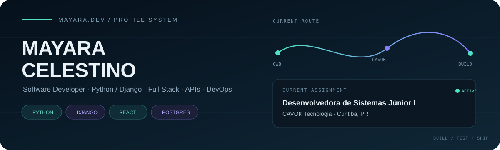

<p align="center">
  
</p>

<br>

<table>
<tr>

<td width="25%" valign="top">

<sub>01 / PROFILE</sub>

### BEYOND  
### THE CODE.

<sub>
Software começa no código,  
mas só faz sentido quando  
resolve alguma coisa.
</sub>

<br><br>

`CURIOSITY`  
`CONTEXT`  
`BUILD`

</td>

<td width="75%" valign="top">

## Gosto de entender antes de construir.

Sou desenvolvedora de sistemas e estudante de **Análise e Desenvolvimento de Sistemas na PUC-PR**.

Minha rotina hoje envolve desenvolvimento e manutenção de sistemas web, mas o que mais me interessa acontece antes da implementação: **entender o contexto, a regra de negócio e o problema que precisa ser resolvido**.

Foi assim que fui construindo minha trajetória entre backend, frontend, integrações, automações e projetos próprios.

Não gosto muito da ideia de estudar uma tecnologia só para poder colocá-la em uma lista. Normalmente prefiro aprender criando alguma coisa com ela — mesmo que comece pequena.

</td>

</tr>
</table>

<br>

<table>
<tr>

<td width="33%" valign="top">

<sub>HOW I THINK</sub>

### context → code

Antes da implementação, tento entender **por que** aquilo precisa existir e como será usado.

</td>

<td width="33%" valign="top">

<sub>MY LAB</sub>

### build to learn

ArenaPass, FitTrack e outros projetos são onde testo tecnologias fora da rotina profissional.

</td>

<td width="33%" valign="top">

<sub>NEXT</sub>

### keep expanding

Backend, Full Stack, segurança, automação e arquitetura continuam fazendo parte da rota.

</td>

</tr>
</table>

<br>

---

<p align="center">
  <sub>02 / WORK DESK</sub>
</p>

<h2 align="center">the tools behind the work</h2>

<p align="center">
  
</p>

<br>

<table>
<tr>

<td width="33%" valign="top">

#### BACKEND

`Python`  
`Django`  
`FastAPI`  
`Java`  
`REST APIs`

</td>

<td width="33%" valign="top">

#### FRONTEND

`JavaScript`  
`React`  
`HTML`  
`CSS`  
`jQuery`  
`Bootstrap`

</td>

<td width="33%" valign="top">

#### DATA / OPS

`PostgreSQL`  
`SQLite`  
`Git`  
`GitHub Actions`  
`Docker`  
`CI/CD`

</td>

</tr>
</table>

<br>

---

<p align="center">
  <sub>02 / FEATURED CASE FILE</sub>
</p>

# ArenaPass

<table>
<tr>

<td width="57%" valign="top">


</td>

<td width="43%" valign="top">

### ACCESS / USERS / SECURITY

Sistema Full Stack para gerenciamento seguro de usuários e diferentes níveis de acesso.

`FASTAPI` `REACT` `JWT`  
`RBAC` `SQLALCHEMY` `BCRYPT`

O projeto trabalha autenticação e autorização de verdade no backend.

**3 access levels**

```text
ADMIN
  └── full management

OPERATOR
  └── view + edit

CLIENT
  └── own profile
```

Autenticação JWT, hash de senha, CRUD de usuários e uma interface que muda conforme o perfil autenticado.

<br>

### [OPEN PROJECT →](https://github.com/maycelestino/arenapass)

</td>

</tr>
</table>

<br>

> **CASE NOTE**
>
> O ArenaPass nasceu como projeto acadêmico, mas foi construído pensando além da entrega da faculdade: organização de API, segurança, separação entre frontend e backend e regras diferentes de autorização.

<br>

---

<p align="center">
  <sub>03 / SYSTEM PIPELINE</sub>
</p>

# FitTrack DevOps

<table>
<tr>

<td width="42%" valign="top">

### FROM CODE TO FEEDBACK

Uma API que virou laboratório para colocar DevOps em prática.

`FASTAPI` `PYTEST`  
`GITHUB ACTIONS` `DOCKER`  
`CI/CD` `DISCORD`

O projeto evoluiu em etapas, passando por testes, automação e containerização.

<br>

### [OPEN PROJECT →](https://github.com/maycelestino/fittrack-devops)

</td>

<td width="58%" valign="top">

```text
           FITTRACK / DELIVERY FLOW


          ┌──────────────┐
          │     CODE     │
          └──────┬───────┘
                 │
                 ▼
          ┌──────────────┐
          │    PYTEST    │
          └──────┬───────┘
                 │
                 ▼
        ┌──────────────────┐
        │  GITHUB ACTIONS  │
        │                  │
        │   CI        CD   │
        └────────┬─────────┘
                 │
                 ▼
          ┌──────────────┐
          │    DOCKER    │
          └──────┬───────┘
                 │
                 ▼
          ┌──────────────┐
          │   DISCORD    │
          │    ALERT     │
          └──────────────┘
```

</td>

</tr>
</table>

<br>

---

<p align="center">
  <sub>04 / CLIENT WORK</sub>
</p>

<table>
<tr>

<td width="65%" valign="top">

# MADC

### Comunicação Visual

Website institucional desenvolvido para uma empresa real.

O objetivo foi criar uma presença digital simples, responsiva e fácil de navegar, desenvolvida com tecnologias web fundamentais.

`HTML` `CSS` `JAVASCRIPT`

Além do desenvolvimento, o projeto também passou por publicação e configuração para uso real.

</td>

<td width="35%" valign="middle" align="center">

### LIVE PROJECT

[**madcdigital.com.br →**](https://madcdigital.com.br)

<br>

```text
STATUS
● ONLINE

TYPE
Institutional Website

DELIVERY
Production
```

</td>

</tr>
</table>

<br>

---

<p align="center">
  <sub>05 / CAREER ARCHIVE</sub>
</p>

# from people to systems

<table>

<tr>

<td width="20%" valign="top">

### 2026
`NOW`

</td>

<td width="80%" valign="top">

### CAVOK TECNOLOGIA

**Desenvolvedora de Sistemas Júnior I**

Python · Django · PostgreSQL · HTML · CSS · JavaScript · jQuery · Bootstrap

Desenvolvimento e manutenção de sistemas, criação de funcionalidades, relatórios personalizados, integrações externas e evolução de recursos existentes.

</td>

</tr>

<tr>

<td width="20%" valign="top">

### 2025
`2026`

</td>

<td width="80%" valign="top">

### HOMMA CAPITAL

**Estagiária em Análise e Desenvolvimento de Software**

Backend · Frontend · Web Scraping · Automação

Participação em desenvolvimento de software, automações, web scraping, documentação técnica e organização de código.

</td>

</tr>

<tr>

<td width="20%" valign="top">

### 2020
`2023`

</td>

<td width="80%" valign="top">

### TELEPERFORMANCE

**Reclame Aqui / Mídias Sociais**

Customer Experience · KPIs · Reputação Digital

Antes de trabalhar diretamente com código, trabalhei bastante com pessoas, problemas e experiência do usuário.

Essa parte da minha trajetória continua influenciando a forma como penso software hoje.

</td>

</tr>

</table>

<br>

---

<p align="center">
  <sub>06 / THE LAB</sub>
</p>

<h2 align="center">things I have been building along the way</h2>

<br>

<table>
<tr>

<td width="50%" valign="top">

### SOFTWARE

```text
├── Python systems
├── REST APIs
├── FastAPI
├── Django
├── React applications
├── Java / OOP
└── responsive websites
```

</td>

<td width="50%" valign="top">

### ENGINEERING / EXPERIMENTS

```text
├── Web scraping
├── Automation
├── CI/CD
├── Docker
├── Application security
├── ESP32
└── sensors / electronics
```

</td>

</tr>
</table>

<br>

---

<p align="center">
  <sub>07 / SIGNAL</sub>
</p>

<h2 align="center">recent GitHub activity</h2>

<p align="center">
  
</p>

<br>

---

<table>
<tr>

<td width="50%" valign="top">

<sub>ACADEMIC ROUTE</sub>

### Análise e Desenvolvimento de Sistemas

**PUC-PR**

```text
2024 ━━━━━━━━━━━━━━━━ 2026
                      ▲
                  in progress
```

Também tenho formação técnica em **Eletrônica**, uma área que fez parte da minha trajetória antes da transição para desenvolvimento de software.

</td>

<td width="50%" valign="top">

<sub>CURRENTLY EXPLORING</sub>

### next checkpoints

```text
01  backend architecture
02  application security
03  full stack development
04  automation
05  cloud fundamentals
```

Sem barra de porcentagem e sem inventar nível.

Só coisas que fazem parte da rota.

</td>

</tr>
</table>

<br>

---

<p align="center">
  <sub>08 / CONTACT CHANNEL</sub>
</p>

<h2 align="center">find me somewhere else</h2>

<p align="center">

<a href="https://linkedin.com/in/mayaracelestino">
  
</a>

<a href="https://github.com/maycelestino">
  
</a>

</p>

<br>

---

```text
maycelestino@github:~$ git status

On branch career
Your branch is up to date with 'origin/learning'.

Changes not staged for stopping:
    modified: skills
    modified: experience
    modified: projects

nothing to stop, keep building.
```

<p align="center">
  <sub>
    MAYARA CELESTINO / SOFTWARE DEVELOPMENT / CURITIBA — BR
  </sub>
</p>

<p align="center">
  
</p>
