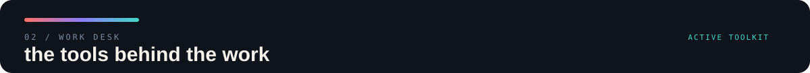
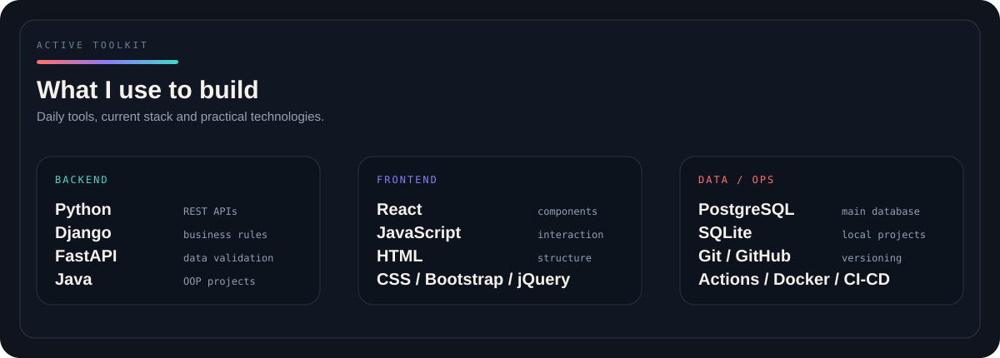
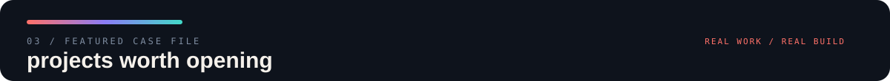
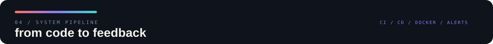
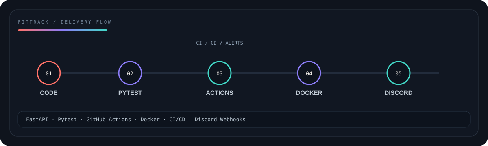
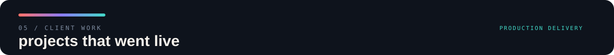
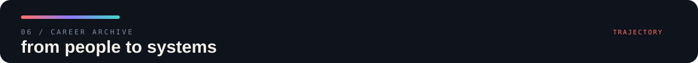
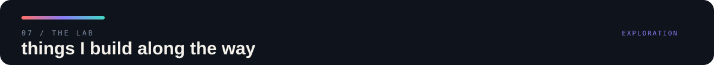
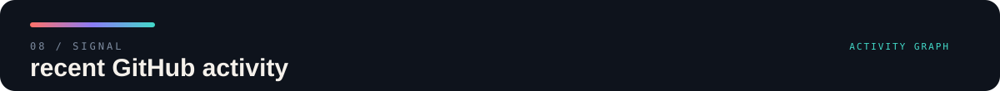
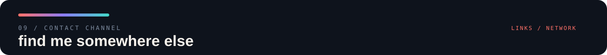

<p align="center">
  
</p>

<br>

<table>
<tr>

<td width="25%" valign="top">

<sub>01 / PROFILE</sub>

### BEYOND
### THE CODE.

<sub>
Software começa no código,  
mas só faz sentido quando  
resolve alguma coisa.
</sub>

<br><br>

`CURIOSITY`  
`CONTEXT`  
`BUILD`

</td>

<td width="75%" valign="top">

## Gosto de entender antes de construir.

Sou desenvolvedora de sistemas e estudante de **Análise e Desenvolvimento de Sistemas na PUC-PR**.

Minha rotina hoje envolve desenvolvimento e manutenção de sistemas web, mas o que mais me interessa acontece antes da implementação: **entender o contexto, a regra de negócio e o problema que precisa ser resolvido**.

Foi assim que fui construindo minha trajetória entre backend, frontend, integrações, automações e projetos próprios.

Não gosto muito da ideia de estudar uma tecnologia só para poder colocá-la em uma lista. Normalmente prefiro aprender criando alguma coisa com ela — mesmo que comece pequena.

</td>

</tr>
</table>

<br>

<table>
<tr>

<td width="33%" valign="top">

<sub>HOW I THINK</sub>

### context → code

Antes da implementação, tento entender **por que** aquilo precisa existir e como será usado.

</td>

<td width="33%" valign="top">

<sub>MY LAB</sub>

### build to learn

ArenaPass, FitTrack e outros projetos são onde testo tecnologias fora da rotina profissional.

</td>

<td width="33%" valign="top">

<sub>NEXT</sub>

### keep expanding

Backend, Full Stack, segurança, automação e arquitetura continuam fazendo parte da rota.

</td>

</tr>
</table>

<br>

---

<p align="center">
  
</p>

<p align="center">
  
</p>

<br>

<sub>DAILY / PROFESSIONAL</sub>

Hoje, minha stack profissional está concentrada principalmente em **Python, Django e PostgreSQL**, junto de tecnologias web utilizadas na evolução e manutenção dos sistemas em que trabalho.

FastAPI, React, Docker e GitHub Actions também fazem parte dos projetos que venho construindo fora da rotina profissional.

<br>

---

<p align="center">
  
</p>

# ArenaPass

<table>
<tr>

<td width="57%" valign="top">


</td>

<td width="43%" valign="top">

### ACCESS / USERS / SECURITY

Sistema Full Stack para gerenciamento seguro de usuários e diferentes níveis de acesso.

`FASTAPI` `REACT` `JWT`  
`RBAC` `SQLALCHEMY` `BCRYPT`

O projeto trabalha autenticação e autorização diretamente no backend.

**3 access levels**

```text
ADMIN
  └── full management

OPERATOR
  └── view + edit

CLIENT
  └── own profile
```

Autenticação JWT, hash de senha, CRUD de usuários e uma interface que muda conforme o perfil autenticado.

<br>

### [OPEN PROJECT →](https://github.com/maycelestino/arenapass)

</td>

</tr>
</table>

<br>

> **CASE NOTE**
>
> O ArenaPass nasceu como projeto acadêmico, mas foi desenvolvido pensando além da entrega da faculdade: organização da API, segurança, separação entre frontend e backend e diferentes regras de autorização.

<br>

---

<p align="center">
  
</p>

# FitTrack DevOps

<table>
<tr>

<td width="40%" valign="top">

### FROM CODE TO FEEDBACK

Uma API que acabou se tornando um laboratório para colocar conceitos de DevOps em prática.

`FASTAPI` `PYTEST`  
`GITHUB ACTIONS` `DOCKER`  
`CI/CD` `DISCORD`

O projeto começou como uma API e foi evoluindo em etapas, passando por testes automatizados, integração contínua, entrega contínua, containerização e alertas.

<br>

### [OPEN PROJECT →](https://github.com/maycelestino/fittrack-devops)

</td>

<td width="60%" valign="middle">



</td>

</tr>
</table>

<br>

<sub>PIPELINE NOTES</sub>

`CODE → TEST → CI → CD → DOCKER → ALERT`

A ideia do projeto foi experimentar cada etapa separadamente e depois conectar tudo em um fluxo automatizado.

<br>

---

<p align="center">
  
</p>

<table>
<tr>

<td width="64%" valign="top">

# MADC

### Comunicação Visual

Website institucional desenvolvido para uma empresa real.

O projeto nasceu da necessidade de criar uma presença digital simples, responsiva e fácil de navegar.

`HTML` `CSS` `JAVASCRIPT`

Além da construção da interface, o projeto passou por publicação e configuração para utilização em produção.

</td>

<td width="36%" valign="middle" align="center">

<sub>LIVE PROJECT</sub>

### ONLINE

[**madcdigital.com.br →**](https://madcdigital.com.br)

<br>

```text
TYPE
Institutional Website

STACK
HTML / CSS / JS

STATUS
● Production
```

</td>

</tr>
</table>

<br>

---

<p align="center">
  
</p>

<table>

<tr>

<td width="18%" valign="top">

### 2026

`NOW`

</td>

<td width="82%" valign="top">

### CAVOK TECNOLOGIA

**Desenvolvedora de Sistemas Júnior I**

`Python` `Django` `PostgreSQL` `HTML` `CSS` `JavaScript` `jQuery` `Bootstrap`

Desenvolvimento e manutenção de sistemas, criação de funcionalidades, relatórios personalizados, integrações externas e evolução de recursos existentes.

</td>

</tr>

<tr>

<td width="18%" valign="top">

### 2025

`2026`

</td>

<td width="82%" valign="top">

### HOMMA CAPITAL

**Estagiária em Análise e Desenvolvimento de Software**

`Backend` `Frontend` `Web Scraping` `Automação`

Participação em desenvolvimento de software, automações, web scraping, documentação técnica e organização de código.

</td>

</tr>

<tr>

<td width="18%" valign="top">

### 2020

`2023`

</td>

<td width="82%" valign="top">

### TELEPERFORMANCE

**Reclame Aqui / Mídias Sociais**

`Customer Experience` `KPIs` `Reputação Digital`

Antes de trabalhar diretamente com código, trabalhei bastante com pessoas, problemas e experiência do usuário.

Essa parte da minha trajetória continua influenciando a maneira como penso software hoje.

</td>

</tr>

</table>

<br>

### ACADEMIC ROUTE

<table>
<tr>

<td width="62%" valign="top">

**Análise e Desenvolvimento de Sistemas — PUC-PR**

```text
2024 ━━━━━━━━━━━━━━━━━━━ 2026
                         ▲
                     in progress
```

</td>

<td width="38%" valign="top">

**Formação Técnica**

Eletrônica — Centro Paula Souza / ETEC

Uma área que fez parte da minha trajetória antes da transição para desenvolvimento de software.

</td>

</tr>
</table>

<br>

---

<p align="center">
  
</p>

<table>
<tr>

<td width="50%" valign="top">

### SOFTWARE

```text
├── Python systems
├── REST APIs
├── FastAPI
├── Django
├── React applications
├── Java / OOP
└── responsive websites
```

</td>

<td width="50%" valign="top">

### ENGINEERING / EXPERIMENTS

```text
├── Web scraping
├── Automation
├── CI/CD
├── Docker
├── Application security
├── ESP32
└── sensors / electronics
```

</td>

</tr>
</table>

<br>

<table>
<tr>

<td width="50%" valign="top">

<sub>CURRENTLY EXPLORING</sub>

### next checkpoints

`Backend Architecture`  
`Application Security`  
`Full Stack Development`  
`Automation`  
`Cloud Fundamentals`

</td>

<td width="50%" valign="top">

<sub>HOW I LEARN</sub>

### project first.

Normalmente, quando quero entender melhor alguma tecnologia, tento encontrar uma forma de colocá-la em algum projeto.

É assim que APIs, React, Docker, CI/CD e segurança acabaram entrando no meu GitHub.

</td>

</tr>
</table>

<br>

---

<p align="center">
  
</p>

<p align="center">
  
</p>

<br>

<table>
<tr>

<td width="33%" align="center">

<sub>BUILD</sub>

### projects

Transformando estudo em implementação.

</td>

<td width="33%" align="center">

<sub>LEARN</sub>

### continuously

Sempre tem alguma coisa nova na fila.

</td>

<td width="33%" align="center">

<sub>SHIP</sub>

### make it real

Código fica mais interessante quando sai do editor.

</td>

</tr>
</table>

<br>

---

<p align="center">
  
</p>

<br>

<table>
<tr>

<td width="50%" align="center" valign="middle">

<sub>PROFESSIONAL NETWORK</sub>

### LinkedIn

Carreira, experiências e evolução profissional.

<br>

[**linkedin.com/in/mayaracelestino →**](https://linkedin.com/in/mayaracelestino)

</td>

<td width="50%" align="center" valign="middle">

<sub>CODE / PROJECTS</sub>

### GitHub

Projetos, experimentos e tudo que estou construindo por aqui.

<br>

[**github.com/maycelestino →**](https://github.com/maycelestino)

</td>

</tr>
</table>

<br>

---

```text
maycelestino@github:~$ git status

On branch career
Your branch is up to date with 'origin/learning'.

Changes not staged for stopping:
    modified: skills
    modified: experience
    modified: projects

nothing to stop, keep building.
```

<p align="center">
  <sub>
    MAYARA CELESTINO / SOFTWARE DEVELOPMENT / CURITIBA — BR
  </sub>
</p>