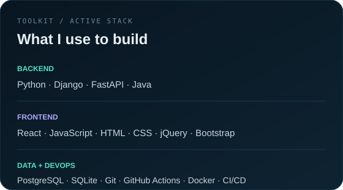
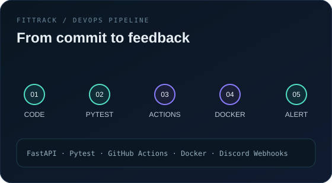

  

  <a href="https://linkedin.com/in/mayaracelestino">LinkedIn</a>
  &nbsp;&nbsp;·&nbsp;&nbsp;
  <a href="https://github.com/maycelestino">GitHub</a>
  &nbsp;&nbsp;·&nbsp;&nbsp;
  <a href="https://github.com/maycelestino/arenapass">ArenaPass</a>
  &nbsp;&nbsp;·&nbsp;&nbsp;
  <a href="https://github.com/maycelestino/fittrack-devops">FitTrack</a>

 

01 / about

<table>
<tr>
<td width="58%" valign="top">

Sou desenvolvedora de sistemas e estudante de Análise e Desenvolvimento de Sistemas na PUC-PR.

Hoje atuo no desenvolvimento e manutenção de sistemas web, trabalhando principalmente com Python, Django e PostgreSQL, além de front-end, integrações e evolução de funcionalidades.

Gosto especialmente de pegar uma regra de negócio, entender onde está o problema e transformar isso em uma solução que realmente funcione no uso diário.

Minha trajetória em tecnologia também passou por backend, frontend, automação e web scraping — e boa parte do que estudo acaba virando projeto prático por aqui.

</td>
<td width="42%" valign="top">

current:
  company: CAVOK Tecnologia
  role: Junior Developer

focus:
  - Backend
  - Full Stack
  - APIs
  - DevOps

study:
  course: ADS
  university: PUC-PR
  status: in progress

</td>
</tr>
</table>

02 / toolkit

  

03 / selected work

ArenaPass

<table>
<tr>
<td width="56%" valign="top">

</td>
<td width="44%" valign="top">

Full Stack user management platform

FastAPI React JWT RBAC SQLAlchemy bcrypt

Projeto criado para aplicar, na prática, conceitos de API REST, autenticação, autorização e segurança.

Highlights

autenticação com JWT;

controle de acesso por perfil;

Administrador, Operador e Cliente;

CRUD de usuários;

dashboard React integrado à API;

hash seguro de senhas.

 

Open repository →

</td>
</tr>
</table>

 

FitTrack DevOps

<table>
<tr>
<td width="46%" valign="top">

API + DevOps workflow

FastAPI Pytest GitHub Actions Docker CI/CD

Projeto desenvolvido para praticar um fluxo completo de desenvolvimento, testes, integração e entrega.

A aplicação inclui testes automatizados, pipelines no GitHub Actions, Docker e alertas via Discord.

 

Open repository →

</td>
<td width="54%" valign="top">

</td>
</tr>
</table>

 

MADC Comunicação Visual

Website institucional desenvolvido para uma empresa real, com foco em responsividade, clareza e navegação simples.

HTML CSS JavaScript

Visit website →

04 / experience

<table>
<tr>
<td width="33%" valign="top">

2026 — now

CAVOK Tecnologia
Desenvolvedora de Sistemas Júnior I

Python Django PostgreSQL

Desenvolvimento e manutenção de sistemas, novas funcionalidades, relatórios personalizados, integrações e correções.

</td>
<td width="33%" valign="top">

2025 — 2026

Homma Capital
Estagiária em Análise e Desenvolvimento de Software

Backend Frontend Web Scraping

Participação em desenvolvimento, automações, web scraping e documentação técnica.

</td>
<td width="33%" valign="top">

2020 — 2023

Teleperformance
Reclame Aqui / Mídias Sociais

KPIs Customer Experience

Experiência que fortaleceu minha visão de usuário, comunicação e resolução de problemas.

</td>
</tr>
</table>

05 / beyond the daily stack

Além da rotina profissional, venho explorando projetos com React, FastAPI, Java, APIs REST, Docker, CI/CD, segurança de aplicações, automação e ESP32.

currently exploring
├── backend architecture
├── application security
├── full stack development
├── automation
└── cloud fundamentals

06 / contact

LinkedIn · GitHub

maycelestino@github:~$ git status

On branch career
Your branch is up to date with 'origin/learning'.

Changes not staged for stopping:
    modified: skills
    modified: experience
    modified: projects

nothing to stop, keep building.