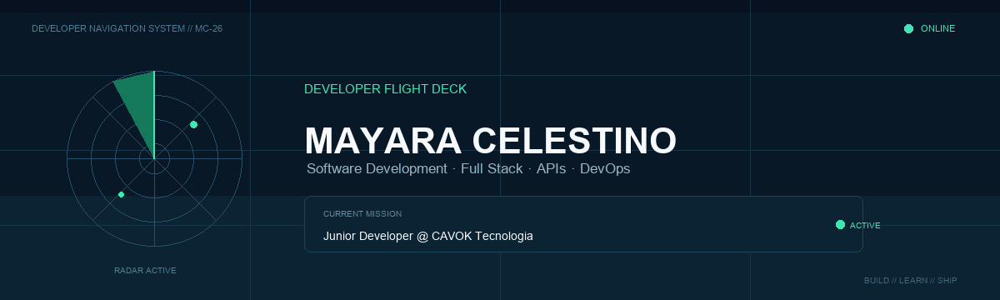

<p align="center">
  
</p>

<br>

## ✈ Flight Plan

Sou **Mayara Celestino**, Desenvolvedora Júnior e estudante de **Análise e Desenvolvimento de Sistemas**.

Atualmente faço parte da **CAVOK Tecnologia**, trabalhando com desenvolvimento e evolução de sistemas enquanto continuo aprofundando meus conhecimentos em back-end, front-end, APIs, bancos de dados e DevOps.

Gosto principalmente de transformar regras de negócio em soluções que façam sentido no uso real do código à interface.

```text
CURRENT POSITION   Junior Developer
COMPANY            CAVOK Tecnologia
FIELD              Software Development
ACADEMIC ROUTE     Análise e Desenvolvimento de Sistemas
CURRENT FOCUS      Full Stack • APIs • DevOps
STATUS             Building • Learning • Shipping
```

---

## ◈ On-board Systems

<table>
<tr>
<td width="33%" valign="top">

### BACK-END

```text
Python
Django
FastAPI
Java
REST APIs
```

</td>

<td width="33%" valign="top">

### FRONT-END

```text
JavaScript
React
HTML
CSS
```

</td>

<td width="33%" valign="top">

### DATA & OPS

```text
PostgreSQL
SQLite
Git
GitHub Actions
Docker
CI/CD
```

</td>
</tr>
</table>

---

## ◉ Mission Log

### 🔐 ArenaPass

**Sistema Full Stack para gerenciamento seguro de usuários.**

Aplicação criada para explorar segurança em APIs e diferentes níveis de autorização.

```text
STACK
FastAPI • React • SQLAlchemy • SQLite
JWT • RBAC • bcrypt • Pydantic
```

**Sistemas implementados**

- API REST para gerenciamento de usuários
- Autenticação utilizando JWT
- Controle de acesso baseado em perfis
- Perfis Administrador, Operador e Cliente
- Hash de senhas com bcrypt
- Dashboard React integrado ao back-end

> Status: `MISSION COMPLETE`

---

### ⚙ FitTrack DevOps

**API desenvolvida para aplicação prática de conceitos de DevOps.**

O projeto percorreu diferentes etapas de um fluxo de desenvolvimento e entrega.

```text
STACK
FastAPI • Pytest • GitHub Actions
Docker • CI/CD • Discord Webhooks
```

**Sistemas implementados**

- Testes automatizados
- Pipeline de Continuous Integration
- Continuous Delivery
- Dockerização da aplicação
- Execução dos testes em Pull Requests
- Alertas automáticos via Discord

> Status: `MISSION COMPLETE`

---

## ◇ Development Route

```text
                    SOFTWARE DEVELOPMENT

                           ▲
                           │
                ┌──────────┴──────────┐
                │                     │
             BACK-END              FRONT-END
                │                     │
        Python • Django          React • JS
        FastAPI • APIs           HTML • CSS
                │                     │
                └──────────┬──────────┘
                           │
                         DATA
                  PostgreSQL • SQLite
                           │
                           ▼
                        DEVOPS
                Git • Docker • CI/CD
```

---

## ⌁ Currently Exploring

Estou continuamente aprofundando conhecimentos em:

- arquitetura e desenvolvimento de APIs;
- desenvolvimento Full Stack;
- segurança de aplicações web;
- automação e pipelines CI/CD;
- containers com Docker;
- boas práticas de desenvolvimento e versionamento.

---

## 📡 Radio Contact

<p align="left">
  <a href="COLOQUE_AQUI_SEU_LINK_DO_LINKEDIN">
    LinkedIn
  </a>
  &nbsp;&nbsp;•&nbsp;&nbsp;
  <a href="mailto:COLOQUE_AQUI_SEU_EMAIL">
    E-mail
  </a>
  &nbsp;&nbsp;•&nbsp;&nbsp;
  <a href="https://github.com/maycelestino">
    GitHub
  </a>
</p>

---

<p align="center">
  <sub>
    MAYARA CELESTINO // DEVELOPER FLIGHT DECK // SYSTEM ONLINE
  </sub>
</p>